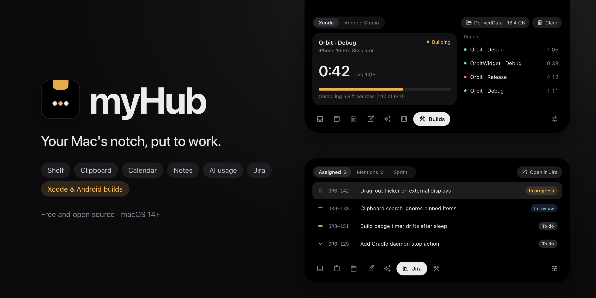

<p align="center">
  
</p>

# MyHub

A macOS notch utility. At rest it is invisible; point at the notch (or push
the pointer against the top-centre edge on a display without one), press
**⌥ Space**, or **⌘⇧V** for the clipboard, and a black panel drops down with a
dock of tools along its bottom.

## Download

**[⬇︎ Download the latest MyHub for macOS](https://github.com/orazz/MyHub/releases/latest)** (the `.dmg`
under *Assets*) · [all releases](https://github.com/orazz/MyHub/releases)

Requires **macOS 15 Sequoia or later** on an **Apple silicon** Mac. Open the DMG and
drag **MyHub** to **Applications**. The app is signed with a Developer ID and
notarized by Apple, so it opens without a security warning. MyHub lives in the
menu bar and the notch, not in the Dock; launch it again to bring back a hidden
menu bar icon.

Nothing asks for permission at launch. Calendar, Accessibility (paste with ⏎),
Screen Recording (the ruler's colour loupe) and folder access (screenshot
collection) are each requested only when you turn on the feature that needs them.

| Section | What it does |
|---|---|
| **Stash** | Drop files on the notch to keep them at hand; drag them out again (⌘/⇧-click for several). Files are remembered by bookmark, so renames and moves don't lose them. Optionally collects every new screenshot (Settings → Stash); image tiles offer **Annotate** (Preview's Markup) and **Copy at 1x**. **Email** any file (hover a tile, or select several): a new message opens with them attached — in your mail app, or in Mail when the default is a webmail browser. **Ask AI** about any file, a selection, or a window you click, in whichever of these you have: Claude Code (opens in your terminal with the question typed in, ready to send), the Codex app (a new chat in that folder), or the Claude and ChatGPT apps (the files are handed over and your question goes on the clipboard). |
| **Inbox** | What needs you, newest first: GitHub review requests, reviews (approved / changes requested) and comments on your open pull requests, @mentions, Jira mentions, and **Figma** comments on files you watch (mentions, replies in your threads, new comments and named versions — react 👍, reply or copy the link from the row; Settings → Figma, personal access token). Unread items have a dot; opening one marks it read. A quiet grey count sits on the closed notch while anything is unread (Settings → Inbox). Needs the GitHub token from Dev → Git and/or a Jira connection; checks every 3 min while open, every 10 min otherwise. |
| **Agents** | Your coding agents, live: each Claude Code session shows what it's reading, editing and running, step by step, with a pill on the closed notch while it works and a flash (with a little hop) when it finishes or needs you. Works with **Claude Code** (terminal and VS Code), **Codex** and **Gemini CLI**: connect each from the Agents tab or Settings → Agents. MyHub adds one hook to that agent's settings (`~/.claude/settings.json`, `~/.codex/hooks.json`, `~/.gemini/settings.json`; a backup is kept, remove any time), and the agent reports to MyHub over this Mac's loopback only. Codex asks you to trust the new hook once (`/hooks` in Codex). Optional (Settings → Agents): **approve or deny Claude Code's permission requests from the notch** — Allow / Deny / Ask in terminal, with a countdown; an unanswered request goes back to Claude Code's own prompt, and nothing is ever approved automatically. Nothing is stored or sent anywhere. |
| **Clipboard** | Searchable history of copied text and files, typed as link / code / colour / text. ↑↓ select, ⏎ pastes into the app underneath (with Accessibility permission), ⌘P pins, ⌫ deletes. Password-manager copies and excluded apps are never recorded. In memory by default; optional encrypted persistence. A row of **dev tools** acts on the selected text: format/minify JSON, decode a JWT (never verified or sent anywhere), Base64 and URL coding, Unix ⇄ ISO timestamps, SHA-256/MD5, new UUID. |
| **Calendar** | Next meetings for a week with a countdown and a **Join** button (Meet, Zoom, Teams, Webex…). Only https links to known meeting hosts get a button. Reads this Mac's calendars. |
| **Notes** | A scratchpad with `- [ ]` checklists you can tick in place; click the text to edit. Esc gives the keyboard back. **Snippets** (⌃⌥S): saved text pasted with one click, with `{{date}}`, `{{time}}`, `{{clipboard}}`, `{{uuid}}`… filled in. |
| **Focus** | A Pomodoro timer with a large clock: pick Focus / Short break / Long break, Start · Pause · Skip · Reset, round bars and today's rounds and focused time. Phases run into each other automatically, with a chime and a notch flash at each change; the countdown sits on the closed notch. **Timer settings** holds the lengths and the Do Not Disturb Shortcuts (run when a round starts and ends, e.g. to turn a Focus mode on). |
| **AI usage** | Current session, weekly limit and 7-day tokens per provider — see below. |
| **Jira** | Tickets assigned to you (priority, status; ↑↓, ⏎ opens, ⌘C copies the key), comments that @mention you (reply inline), and your active sprint's board. Connect with your Jira Cloud site, email and an API token (kept in the Keychain, sent only to your `*.atlassian.net` site). Optional: check every 15 minutes and flash the notch for a new mention. |
| **Builds** | The Xcode or Gradle build running now (timer, time against the usual length), recent results, DerivedData / Gradle cache size with Clear / Stop daemons. The closed notch flashes the result when a build ends. |
| **Dev** | **Simulators**: screenshot or record into the Stash, light/dark, 9:41 status bar, deep links, test pushes, erase. **Git**: pinned repos with branch, ahead/behind, changes, last commit, the open pull request and its checks. **CI**: recent GitHub Actions runs; the notch flashes when a running one finishes. **Cleanup**: sizes of DerivedData, device support, simulators, caches, previews, archives — reclaim with a confirm. |

**Measure Screen** (menu bar or ⌃⌥M): a ruler overlay on every display —
drag to measure in points and pixels, C copies; press L for a colour loupe
(needs Screen Recording, asked only then). Esc closes.

**Switching tabs from the keyboard**: with the panel open, hold **⌥** to see each
tab's letter on the dock and press ⌥ + letter to jump there (⌥S Stash, ⌥I Inbox,
⌥C Clipboard, ⌥A Calendar, ⌥N Notes, ⌥F Focus, ⌥U AI usage, ⌥J Jira, ⌥B Builds,
⌥D Dev, ⌥G Agents, ⌥, Settings), or ⌥← / ⌥→ for the previous / next tab. The shortcuts
exist only while the panel is open, and pause
while you type in a field, so ⌥ still types accents there.

**Themes** (Settings → Theme): Classic black, or a gradient that fades from the
notch into Midnight, Aurora, Sunset, Grape or Graphite, each with its own
accent. Status colours (in progress, failed, done) stay the same on every theme.

**Privacy Shield** (menu bar) masks clipboard, calendar, notes and AI usage
for screen sharing. Covered rows show a fixed hatch — no blur, no length.

## AI Usage sources

| Source | Data | Auth | Kind |
|---|---|---|---|
| Claude plan (Pro/Max) | 5-hour and weekly limits, product breakdown | Claude Code's sign-in (Keychain, read-only) | unofficial |
| Claude Code on this Mac | Tokens and API-equivalent cost from `~/.claude` logs | none | estimated |
| ChatGPT / Codex plan | 5-hour and weekly limits | `~/.codex/auth.json` (read-only) | unofficial |
| Codex on this Mac | Tokens and last-seen limits from `~/.codex/sessions` | none | estimated |
| Anthropic API | Spend today / this month, tokens by model | Admin key | official |
| OpenAI API | Spend today / this month, tokens by model | Admin key | official |
| OpenRouter | Spend today / week / month, key limit | API key | official |
| AWS Bedrock | Tokens by model (CloudWatch), optional cost (Cost Explorer) | access keys or `~/.aws` profile | official |
| Custom endpoint | Budget, spend, reset — LiteLLM preset or any JSON | optional key | as reported |

Keys live only in the Keychain. Requests go only to each source's own host,
over HTTPS, never follow redirects, and are never logged beyond
method/host/status. Optional: the fullest limit in the menu bar, and
notifications at 80% / 95% (Settings → AI Usage).

## Build

Requires macOS 15+ and Swift 6.

- **To build and run:** the free Command Line Tools are enough
  (`xcode-select --install`); `./Scripts/bundle.sh` works with them.
- **To run the tests:** full Xcode — the Command Line Tools don't include the
  Swift Testing library.
- **At runtime:** Dev → Simulators, the Builds tab's Xcode history and parts of
  Cleanup work with Xcode's data, so they need Xcode installed. Git needs the
  Command Line Tools; everything else needs neither.

```bash
swift test                              # 215 tests
MYHUB_SNAPSHOT_DIR=/tmp/snaps swift test --filter PanelSnapshots  # render every tab to PNG
./Scripts/bundle.sh && open build/MyHub.app
MYHUB_LIVE=1 swift test --filter LiveLogs   # optional: read this Mac's Claude Code logs
MYHUB_LIVE=1 swift test --filter LiveDev    # optional: real git, simctl and GitHub's public API
```

`bundle.sh` signs with an Apple Development certificate when one is present
(so Keychain permissions survive rebuilds), otherwise ad-hoc.

### Release

```bash
./Scripts/dmg.sh                          # build/MyHub-<version>.dmg
CODESIGN_IDENTITY="Developer ID Application: …" ./Scripts/notarize.sh
```

Notarization needs a **Developer ID Application** certificate and a stored
`notarytool` profile — see the header of `Scripts/notarize.sh`. The version
lives in `Scripts/version`; the app icon is built from `Resources/logo.png` by
`swift Scripts/make-icon.swift Resources/AppIcon.icns Resources/logo.png`.

## Layout

See `docs/PLAN.md` for the architecture, the thread-safety and security
models, and decisions. Project conventions for contributors are in
`CLAUDE.md` and `.claude/skills/`.

## Dev tools: how they reach things

- `git`, `xcrun simctl` and `shortcuts` run through `CommandRunner`: an
  absolute path, an argument array (never a shell), a clean environment and a
  timeout. Nothing typed into MyHub is ever interpreted by a shell.
- GitHub is read through its REST API on `api.github.com` only. A token is
  optional (public repos work without one, at 60 requests an hour); a
  fine-grained read-only token goes in the Keychain. Links opened in the
  browser must be `https://github.com/…`.
- Nothing polls in the background except a CI run you can see is in
  progress (every 30 s with a token, 90 s without), until it finishes.

## License

Copyright © 2026 Oraz.

MyHub is free software: you can redistribute it and/or modify it under the
terms of the GNU General Public License, version 3 or (at your option) any
later version. It is distributed WITHOUT ANY WARRANTY. See [LICENSE](LICENSE)
for the full text.
